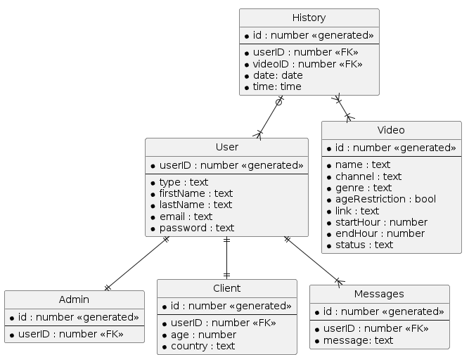

# Serviciu de streaming pentru clipuri, cu planificator pe ore și gestionare useri
## Grupa 30237, Coșarcă Ioan-Cristian

Această documentație are rolul de a ghida navigarea prin utilizarea aplicației

- Organizare și Tehnologii
- Funcționalitate / Scop
- Funcționalități Expuse
- Baza de date
- Endpoints
- Observer Pattern
- Testarea
- FrontEnd (Angular)

## Organizare și Tehnologii

Partea de backend a acestei aplicații este reprezentată de acest proiect Java / Springboot și se găsește în branch-ul final-backend.

Partea de frontend a acestei aplicații este reprezentată de proiectul pereche făcut în Angular Typescript, care se găsește în branch-ul frontend.

## Funcționalitate / Scop

Acest proiect trebuie să descrie o aplicație care să ofere o interfață ce să-i permită unui utilizator să selecteze și să vizioneze clipurile dorite de el.

De asemenea, aplicația trebuie să se descurce în a gestiona mai mulți utilizatori conectați simultan, clipurile fiind disponibile doar între anumite ore și doar pentru un anumit utilizator, pe rând. Restul utilizatorilor trebuie să aștepte până când ora curentă devine ora la care se deblochează videoclipul sau până când utilizatorul curent își încheie vizionarea.

## Funcționalități Expuse

Aplicația trebuie să-i permită unui tip de utilizator să se înregistreze sau să se autentifice, fie că este vorba de un simplu utilizator / client, fie că e vorba de un administrator.

Un administrator ar trebui să poată gestiona clipurile care sunt încărcate / referențiate în aplicație. El poate viziona un videoclip și poate decide dacă va rămâne sau îl poate da jos / elimina. De asemenea, poate încărca videoclipuri noi sau vizualiza o evidență a lor după un anumit criteriu.

Un utilizator ar trebui să poată vedea videoclipurile și să poată selecta unul pentru vizualizare. Un videoclip poate fi vizionat dacă ora curentă corespunde intervalului orar între care este disponibil sau dacă utilizatorul care l-a accesat înainte și-s terminat vizionarea. De asemenea, poate fi vizionat doar dacă în momentul curent nu este deja vizionat de un alt utilizator.

Utilizatorul ar trebui să își poată gestiona contul, modificând detaliile pe care le dorește și să își poată viziona notificările primite.

Administratorul ar trebui de asemenea să își poată gestiona contul, precum și să poată vedea o evidență a tuturor utilizatorilor din baza de date.

Orice utilizator (client sau administrator) ar trebui să poată să își vadă istoricul vizionăriilor și să îl șteargă la alegere. Pe lângă aceasta, un administrator ar trebui să poată să vizioneze istoricul global, observând ce utilizator s-a uitat la ce clip și când.

Orice utilizator trebuie să se poată deconecta și are opțiunea de a-și șterge contul.

## Baza de Date

Baza de Date este împărțită în 6 tabele: User, Admin, Client, Video, History și Messages.

User reține toate înformațiile despre un utilizator, câmpuri de informații care ar fi comune între un Client și un Administrator: tip utilizator, nume, email și parolă.

Tabela Client va avea un Foreign Key către tabela User pentru a-și lua informațiile de acolo. În plus, fiecare Client are o vârstă și o țară din care provine (informații ce vor fi folosite pentru recomandări de videoclipuri).

Tabela Admin va avea un Foreign Key către tabela User, deoarece un Administrator este și el un utilizator.

Tabela Video reține toate datele despre un videoclip: nume, canal, tip videoclip, dacă conținutul său este restrâns unui anumit segment de vârstă, link-ul, ora la care începe să fie disponibil, ora la care devine indisponibil și statusul său.

Tabela History conține istoricul tuturor utilizatorilor. Aceasta are două Foreign Keys, id-ul unui utilizator și id-ul unui video. Aceasta va simboliza că utilizatorul (administrator sau client) cu id-ul userID a vizionat videoclipul cu id-ul videoID.

Tabels Messages reține mesajele primite de fiecare utilizator, având ca și câmpuri id-ul utilizatorului și textul mesajului.

## Endpoints

### GET
Admin
- /getAdmins - returnează o listă cu toți administratorii
- /getAdminByID/{id} - returnează un administrator după id-ul specificat
- /getAdminByEmail/{email} - returnează un administrator după emailul specificat

Client
- /getClients - returnează o listă cu toți clienții
- /getClientByID/{id} - returnează un client după id-ul specificat
- /getClientByEmail/{email} - returnează un client după emailul specificat
- /getClientsByAge/{age} - returnează o listă cu toți clienții care au vârsta specificată
- /getClientsByCountry/{country} - returnează o listă cu toți clienții din țara specificată

History
- /getHistory - returnează o listă cu întregul istoric ("global")
- /allVideosWatchedByThisUser/{userID} - returnează o listă cu întregul istoric al utilizatorului cu id-ul specificat

Messages
- /getUserMessages - returnează o listă cu toate mesajele / notificările primite de utilizatorul cu id-ul specificat

Video
- /getVideos - returnează o listă cu toate videoclipurile
- getVideoByID - returnează un video după id-ul specificat
- /getVideoByName/{name} - returnează un video după numele specificat
- /getVideosByChannel/{channel} - returnează o listă cu toate videoclipurile care provin de la un canal specificat
- /getVideosByGenre/{genre} - returnează o listă cu toate videoclipurile care sunt de genul specificat
- /getVideosByHour/{startHour} - returnează o listă cu toate videoclipurile care încep la ora specificată

### POST
Admin
- /addAdmin - adaugă un administrator în baza de date

Client
- /addClient - adaugă un client în baza de date

History
- /addHistory - adaugă un videoclip în istoricul unui utilizator

Messages
- /addMessage - adaugă un mesaj în baza de date

Video
- /addVideo - adaugă un video în baza de date

### PUT
Admin
- /updateAdmin - cu informațiile nou primite, actualizează un administrator unde coincide id-ul

Client
- /updateClient - cu informațiile nou primite, actualizează un client unde coincide id-ul

History
- /updateHistory - schimbă informațiile unei instanțe de istoric

Video
- /updateVideos - cu informațiile nou primite, actualizează un video unde coincide id-ul

### DELETE
Admin
- /deleteAdmin/{userID} - șterge un administrator din baza de date cu id-ul specificat

Client
- /deleteClient/{userID} - șterge un client din baza de date cu id-ul specificat

History
- /deleteUserHistory/{userID} - șterge întreg istoricul al unui utilizator cu id-ul specificat

Video
- /deleteVideoByID/{id} - șterge un video din baza de date cu id-ul specificat

## Observer Pattern

Această metodă de proiectare este utilă pentru a ilustra relația dintre Clienți și Videoclipuri.

Un Client trebuie să observe starea unui Videoclip pentru a i se permite apoi să îl acceseze sau nu. Dacă un videoclip nu este disponibil dintr-un anumit motiv, nimeni nu îl poate vedea și clienții vor fi anunțați. De asemenea, când un videoclip devine disponibil, toți clienții vor fi notificați.

## Testarea

Pentru testarea funcționalității proiectului s-a folosit JUnit Testing și frameworkul Mokito pentru verificarea că se apelează metodele din clasele care trebuie.

## FrontEnd (Angular)

Pentru partea de frontend a aplicației am folosit Angular. Fiecare componentă a site-urilor este organizată în fișier html, fișier typescript și fișier css.

Componentele de LogIn, Register, precum și alte pagini de căutare / vizualizare a informațiilor am folosit formulare de colectare a informațiilor.

Fiecare tabel al aplicației are un Model care să rețină câmpurile și tipul lor, la fel ca și în backend.

Pentru a apela endpoint-urile din backend și a folosi rezultatul lor în front a fost nevoie de definirea unor fișiere tip servicii. Acestea definesc metode de apelare a endpoint-urilor prin cereri http, metode care vor putea apoi fi folosite în componentele ce injectează serviciile în constructorul lor.
